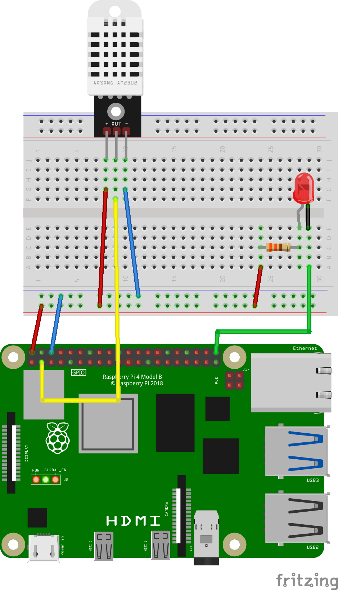

# Raspberry Pi Workshop

## Workshop Description

In this workshop, students shall explore how easy it can be to work with an IoT device.
This workshop consists of three parts:
an introduction to software engineering,
a hands-on experience with Raspberry PIs,
and a reflection part.

### Introduction to Software Engineering

The workshop begins with an introduction on the impact of software on our everyday life and the importance of software engineering.

The Swedish slides are available here: [Google Spreadsheet](https://docs.google.com/presentation/d/1fgE1r-J_mvLzIIb5ylbsFcqQjccgmlm5yWpsgbVMwvg/edit?usp=sharing)

### Hands-on experience

The handout document for students can be found here: [instructions/handout.md](instructions/handout.md)

During this hands-on experience, students follow the handout's instructions and start with a simple `print("something")` statement to understand how to run the code.
In further steps, they learn how to read sensor data and control the code with conditional statements (if).

### Reflection

After the hands-on coding experience, the workshop organizer shall ask the students about their experience and understanding of software systems.

## Wiring schematic

## Preparation (for workshop organizer)

### Setup Raspberry Pi

1. Download the [Raspberry Pi Imager](https://www.raspberrypi.com/software/)
2. Flash the latest version of Raspberry PI OS (with a desktop environment) on a SD-card using the Raspberry Pi Imager
3. Setup a wireless network so that the Pi can connect to the internet
4. Clone this repository on the Pi
5. Use the provided Makefile to set up the environment:
   - Run `make help` to see all available commands
   - Run `make os-deps` to install all required OS dependencies
   - Run `make install-uv` to install the uv package manager
   - Restart the terminal
   - Run `make setup-venv` to create a Python virtual environment
   - Run `make install-deps` to install Python dependencies
   - Use `make install-ollama` to install the ollama
6. Run `ollama run smollm2:360m` to start the LM server

## Bill of Materials (BOM)

IoT platform

- 1x Raspberry Pi 4
- 1x Breadboard
- Jumper wires in different colors (female to male)

Sensors

- 1x AM2302 (Temperature + Humidity)

Signals

- 1x LED
- 1x 330 Ω (ohm) resistor for the LED

## Check setup

After the Raspberry Pi is setup and all components are wired on the breadboard you can run `python check.py` to check the whole setup.
