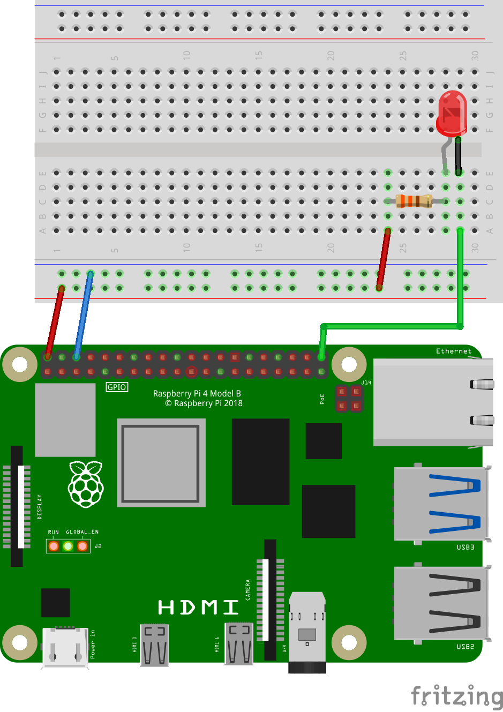

# Raspberry Pi Workshop Instructions

## Introduction

If you are reading this document you have been selected to complete the following challenges.

In order to perform the following tasks, you will be using a Raspberry Pi; one of the smallest and fully featured computers available to hobbyists and professionals alike.

To control the Raspberry Pi you will make use of your programming knowledge and the easy-to-learn programming language Python.

Why Python? Python has become one of the most popular programming languages in the world in recent years. It's used in everything from machine learning to building websites and software testing. It can be used by developers and non-developers alike.

## Task 0: Hello World

The program that most developers are familiar with is "Hello World". In Python, this is a piece of cake! In the function "main" you use the command "print()" to get an output from your program. Between the brackets, you write "Hello World" in between citation notations, now you can execute the program and see that the Raspberry Pi displays "Hello World" on the screen.

Note that the task number is "0", that is because we start counting from zero in programming.

## Task 1: Change it

One of the best and most useful features of software is that you can change it! Now change the output from the previous task so the output is your name.

## Task 2: Make a light show

Using the command `led_on()` and `led_off()` you can control the LED that is plugged in to the Raspberry Pi.

By using the command `while True:` we can make program run forever. and by using the command `sleep(1)` we can make the program wait for 1 second.

By using the commands mentioned above, make the LED blink.

If you did not wired everything you can start by just connecting the red LED to the Raspberry Pi.

## Task 3: It's gettin' hot in herre

Besides the song "Hot In Herre" by Nelly, it feels like the temperature is getting hotter with the Raspberry Pi, and your brain of yours working to complete the tasks. By using the `read_sensor_temperature()` and `read_sensor_humidity()` we can get the temperature and humidity of the surroundings into our program.

Python supports an "if" statement which allows the programmer to ask questions to the system. A statement like the following asks the program if the temperature in the room is lower than 1-degree Celsius: `if read_sensor_temperature() < 1:`.

Now, have the program turn on the LED if the temperature is higher than value X and turn it off if it is lower than value X. You can choose the value of X as you like.

## Task 4: To the great beyond

You have reached the finish line! Now ask your guide what to do. For me, the document, I can't continue further. So I guess this is goodbye... Goodbye!
